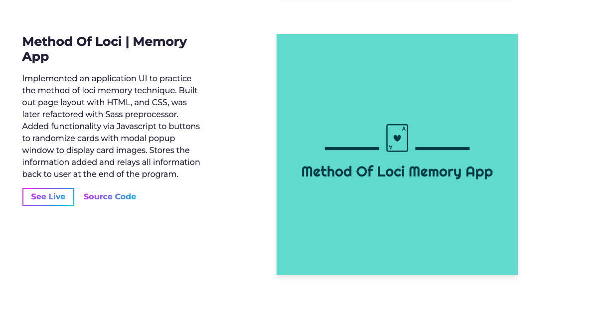

# Portfolio for Justin Scorzafava

A portfolio to display my software applications.

**Link to project: [Live-demo]https://jscorz-portfolio.netlify.app**

---

## **How It's Made:**

---

**Tech used:** HTML, CSS, Bootstrap, SASS, Jquery, Javascript

I had started the layout of the portfolio with a template. I made this decision so I could focus more time on projects. I customized it a bit further to personalize it.
