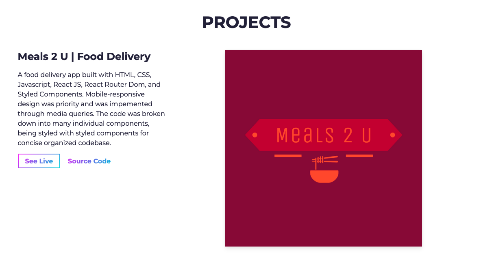

# Portfolio for Justin Scorzafava

A portfolio to display my software applications.

**Link to project: [Live-demo]https://www.justinscorzafava.com**

---

## **How It's Made:**

---

**Tech used:** HTML, CSS, Bootstrap, Sass, Jquery, Javascript

I implemented the layout of the portfolio with a template to begin with. I made this decision so I could focus more time on developing projects. I customized the portfolio a bit further to personalize it.
